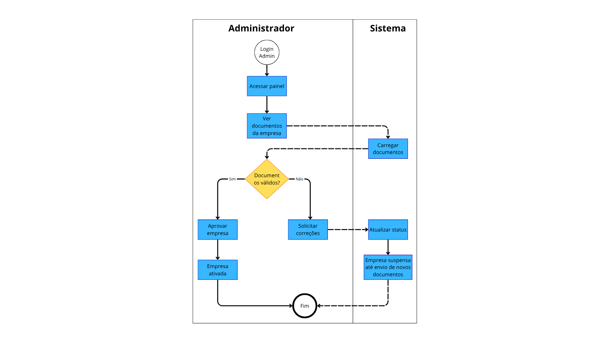

# Projeto de Interface

A interação do usuário na plataforma ocorre por meio de uma navegação simples e intuitiva, estruturada em fluxos que correspondem diretamente aos requisitos e histórias de usuário levantados.  

- **Usuário (Cliente)**: acessa o simulador de economia, solicita orçamentos, compara propostas, avalia empresas e acompanha o histórico de solicitações.  
- **Empresa (Parceiro)**: recebe leads de potenciais clientes, responde com propostas, gerencia seu perfil, acompanha relatórios de desempenho e conversão.  
- **Administrador**: modera avaliações, valida documentos, gerencia planos CPL e supervisiona o funcionamento da plataforma.  

Cada ator interage com telas específicas, mas dentro de uma identidade visual unificada e responsiva.

## Diagrama de Fluxo

A confecção do diagrama foi feito usando o Canva.

Descrição: Diagrama mostrando o uso das configurações, como ativar notificações, aplicar modo escuro e alterar senha. Swinlanes aplicadas para usuário e sistema.

Descrição: Diagrama mostrando como realizar o login ou cadastro, podendo selecionar entre empresa e cliente, também com swinlanes para usuário e sistema.

Descrição: Diagrama mostrando como encontrar empresas que atuam na sua região pesquisando pelo seu CEP. Também com swinlanes para usuário e sistema.

Descrição: Diagrama mostrando a solicitação de orçamento do cliente para empresas. Utilizando swinlanes para usuário, empresa e sistema.

Descrição: Diagrama mostrando como administrador pode aprovar ou rejeitar avaliações. Utilizando swinlanes para administrador e sistema.

Descrição: Diagrama mostrando como administrador aprova ou recusa cadastros de empresas baseado nos documentos enviados. Utilizando swinlanes para administrador e sistema.

Descrição: Diagrama mostrando como o usuário pode simular o tempo estimado para retorno de ivestimento. Utilizando swinlanes para usuário e sistema.

## Wireframes

Os wireframes foram desenvolvidos utilizando o Figma, seguindo os princípios de usabilidade e experiência do usuário. O protótipo completo apresenta 12 telas principais que cobrem todos os fluxos de navegação e funcionalidades do sistema. Cada tela foi projetada para atender requisitos específicos, proporcionando uma experiência intuitiva para diferentes perfis de usuários.

### Tela 1 - Login

**Descrição:** Interface de autenticação do sistema com design moderno e clean. Apresenta fundo em gradiente azul escuro com painel central contendo:

- Logo "SOLAR ENERGY" no cabeçalho
- Título "Login" em destaque
- Campos para email e senha
- Botão "Log in" em laranja
- Link para cadastro de novos usuários

**Requisitos Funcionais Atendidos:**
- RF-011: A aplicação deve permitir a recuperação de senha para usuários e empresas

### Tela 2 - Cadastro

**Descrição:** Formulário de registro para novos usuários com campos organizados de forma clara:

- Dados pessoais (nome, email, telefone)
- Definição de senha
- Termos de uso e política de privacidade
- Botão de confirmação de cadastro
- Opção de voltar ao login

**Requisitos Funcionais Atendidos:**
- RF-006: A aplicação deve permitir que empresas cadastrem e atualizem seu perfil e área de atendimento

### Tela 3 - Busca de Empresas

**Descrição:** Interface de pesquisa e listagem de empresas parceiras com recursos avançados:

- Filtros por localização, serviços e avaliações
- Cards informativos das empresas
- Sistema de estrelas para avaliações
- Mapa interativo com localização
- Botões para solicitar orçamento

**Requisitos Funcionais Atendidos:**
- RF-001: A aplicação deve permitir que o usuário pesquise empresas de energia solar por localização
- RF-003: A aplicação deve exibir as avaliações e área de atendimento das empresas
- RF-010: A aplicação deve integrar mapas/geolocalização para exibir cobertura das empresas e facilitar buscas
- RF-017: A aplicação deve permitir calcular a cobertura geográfica de empresas, integrando dados do sistema de mapas

### Tela 4 - Perfil de Empresa

**Descrição:** Página detalhada da empresa com informações completas:

- Dados da empresa e certificações
- Portfólio de projetos realizados
- Avaliações e comentários de clientes
- Informações de contato
- Botão para solicitar orçamento destacado

**Requisitos Funcionais Atendidos:**
- RF-002: A aplicação deve exibir o perfil detalhado das empresas
- RF-003: A aplicação deve exibir as avaliações e área de atendimento das empresas
- RF-018: A aplicação deve permitir que o usuário agende uma visita técnica com a empresa selecionada

### Tela 5 - Perfil de Usuário

**Descrição:** Área pessoal do usuário para gerenciamento de conta e informações:

- Dados pessoais editáveis
- Foto de perfil
- Histórico de solicitações
- Configurações de conta
- Preferências do sistema

**Requisitos Funcionais Atendidos:**
- RF-005: A aplicação deve permitir que o usuário visualize, avalie e comente sobre as empresas após a contratação
- RF-012: A aplicação deve permitir que o usuário visualize o histórico de solicitações de orçamento realizadas

### Tela 6 - Leads

**Descrição:** Dashboard para empresas visualizarem e gerenciarem leads recebidos:

- Lista de leads com informações básicas
- Status de cada lead (novo, em andamento, finalizado)
- Filtros por data, região e status
- Ações rápidas (responder, arquivar)
- Métricas de conversão

**Requisitos Funcionais Atendidos:**
- RF-007: A aplicação deve permitir que empresas respondam solicitações de orçamento e enviem propostas
- RF-013: A aplicação deve permitir que usuários e empresas recebam notificações sobre o status das solicitações
- RF-015: A aplicação deve permitir que o administrador gerencie leads (CPL), incluindo registro, atribuição e acompanhamento

### Tela 7 - Dashboard Usuário

**Descrição:** Painel principal do usuário com informações relevantes e acesso rápido:

- Resumo de atividades recentes
- Simulações salvas
- Orçamentos pendentes
- Recomendações personalizadas
- Atalhos para funcionalidades principais

**Requisitos Funcionais Atendidos:**
- RF-004: A aplicação deve permitir a comparação de orçamentos recebidos de diferentes empresas
- RF-008: A aplicação deve permitir que o usuário visualize o tempo estimado de retorno do investimento
- RF-012: A aplicação deve permitir que o usuário visualize o histórico de solicitações de orçamento realizadas
- RF-019: A aplicação deve permitir a comparação detalhada de orçamentos recebidos de diferentes empresas

### Tela 8 - Dashboard Empresa

**Descrição:** Painel de controle para empresas parceiras com métricas e informações:

- Estatísticas de leads e conversões
- Gráficos de performance
- Notificações importantes
- Acesso rápido às funcionalidades
- Calendário de atividades

**Requisitos Funcionais Atendidos:**
- RF-006: A aplicação deve permitir que empresas cadastrem e atualizem seu perfil e área de atendimento
- RF-013: A aplicação deve permitir que usuários e empresas recebam notificações sobre o status das solicitações
- RF-014: A aplicação deve permitir a geração de relatório mensal da empresa, exibindo a quantidade de leads recebidos, leads convertidos e taxa de conversão
- RF-020: A aplicação deve permitir que empresas enviem propostas detalhadas em resposta às solicitações de orçamento

### Tela 9 - Dashboard Admin

**Descrição:** Painel administrativo com visão completa do sistema:

- Estatísticas gerais da plataforma
- Monitoramento de usuários e empresas
- Indicadores de performance
- Alertas e notificações do sistema
- Acesso às ferramentas de administração

**Requisitos Funcionais Atendidos:**
- RF-009: A aplicação deve permitir que administradores moderem avaliações e verifiquem documentos das empresas
- RF-015: A aplicação deve permitir que o administrador gerencie leads (CPL), incluindo registro, atribuição e acompanhamento
- RF-016: A aplicação deve permitir que o administrador gerencie planos CPL e usuários, podendo criar, editar, suspender e excluir

### Tela 10 - Gerenciamento de Empresas

**Descrição:** Interface administrativa para gestão de empresas parceiras:

- Lista completa de empresas cadastradas
- Status de aprovação e verificação
- Ferramentas de moderação
- Histórico de atividades das empresas
- Ações em lote (aprovar, suspender, excluir)

**Requisitos Funcionais Atendidos:**
- RF-009: A aplicação deve permitir que administradores moderem avaliações e verifiquem documentos das empresas
- RF-016: A aplicação deve permitir que o administrador gerencie planos CPL e usuários, podendo criar, editar, suspender e excluir

### Tela 11 - Gerenciamento de Leads

**Descrição:** Painel para monitoramento e gestão de todos os leads da plataforma:

- Visão geral de todos os leads
- Filtros avançados por múltiplos critérios
- Métricas de conversão por empresa
- Ferramentas de análise
- Exportação de relatórios

**Requisitos Funcionais Atendidos:**
- RF-015: A aplicação deve permitir que o administrador gerencie leads (CPL), incluindo registro, atribuição e acompanhamento
- RF-014: A aplicação deve permitir a geração de relatório mensal da empresa, exibindo a quantidade de leads recebidos, leads convertidos e taxa de conversão

### Tela 12 - Relatórios

**Descrição:** Central de relatórios com dashboards analíticos completos:

- Gráficos interativos de performance
- Métricas financeiras e operacionais
- Comparativos temporais
- Relatórios personalizáveis
- Exportação em múltiplos formatos

**Requisitos Funcionais Atendidos:**
- RF-014: A aplicação deve permitir a geração de relatório mensal da empresa, exibindo a quantidade de leads recebidos, leads convertidos e taxa de conversão

### Tela 13 - Simulador

Descrição - Painel de simulaçao de gasto e retorno de investimento.

-Simluador de Instalação
-Simulador de Aluguel
-Gráficos de Economia
-Indicadores Financeiros

**Requisitos Funcionais Atendidos:**
RF-013: A aplicação deve permitir a simulação de economia financeira em diferentes horizontes de tempo, considerando valores de consumo, investimento e modalidade (instalação ou aluguel).

RF-015: O sistema deve exibir gráficos comparativos e resultados atualizados em tempo real conforme a alteração dos parâmetros de entrada.

### Tela 14 - Admin

Descrição - Administração de Avaliações e Verificação de Documentos

-Moderação de avaliações
-Validação de documentos
-Monitoramento

**Requisitos Funcionais Atendidos:**
RF-009: A aplicação deve permitir que administradores moderem avaliações e verifiquem documentos das empresas.

RF-016: A aplicação deve permitir que o administrador gerencie planos CPL e usuários, podendo criar, editar, suspender e excluir.

## Protótipo Interativo

O protótipo interativo foi desenvolvido no Figma, permitindo navegação entre as telas e simulação da experiência do usuário. O protótipo inclui:

- **Fluxo de Login/Cadastro:** Demonstra o processo de autenticação
- **Simulação de Economia:** Permite testar o calculador
- **Navegação Principal:** Mostra transições entre telas
- **Responsividade:** Adapta-se a diferentes tamanhos de tela

**Link do Protótipo:** [Visualizar no Figma](https://www.figma.com/design/H7B7JDR2VBbU3cklTLfqJp/Solar-Energy?node-id=0-1&p=f&t=HQJQG9cV2rppr9cJ-0)

### Padrões de Design Aplicados

- **Cores:** Paleta baseada em azul e laranja, transmitindo confiança e energia
- **Tipografia:** Fontes sans-serif para melhor legibilidade
- **Espaçamento:** Grid system consistente em todas as telas
- **Componentes:** Biblioteca de componentes reutilizáveis
- **Iconografia:** Ícones uniformes e intuitivos
