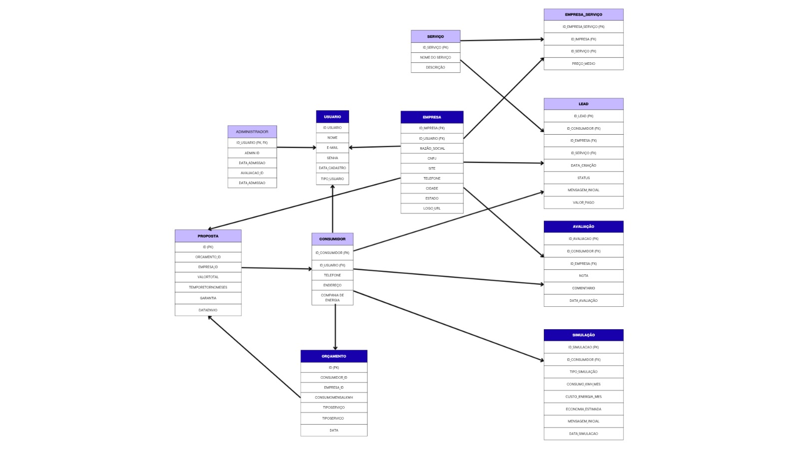

# Arquitetura da Solução

<span style="color:red">Pré-requisitos: <a href="3-Projeto de Interface.md"> Projeto de Interface</a></span>

A arquitetura da solução Solar Energy é baseada no padrão MVC (Model-View-Controller) e estruturada em camadas para facilitar a manutenção e escalabilidade. O sistema é composto por uma aplicação web responsiva que conecta consumidores de energia solar com empresas especializadas, gerenciada por administradores através de painéis de controle.

**Componentes principais:**
- **Frontend**: Interface web responsiva desenvolvida em HTML5, CSS3, JavaScript e Bootstrap
- **Backend**: API REST desenvolvida em C# com .NET Framework seguindo arquitetura MVC
- **Banco de Dados**: SQL Server para persistência de dados dos usuários, empresas, orçamentos e avaliações
- **Sistema de Autenticação**: Gerenciamento seguro de sessões e permissões por perfil de usuário
- **Módulo de Geolocalização**: Integração com APIs de mapas para busca de empresas por região
- **Sistema de Notificações**: Comunicação automatizada entre consumidores e empresas
- **Painel Administrativo**: Interface para moderação, relatórios e gestão de leads CPL

A aplicação será hospedada em ambiente cloud com alta disponibilidade, garantindo performance e segurança dos dados conforme LGPD.

## Diagrama de Classes


O diagrama de classes ilustra graficamente como será a estrutura do software, e como cada uma das classes da sua estrutura estarão interligadas. Essas classes servem de modelo para materializar os objetos que executarão na memória.

O diagrama representa a estrutura orientada a objetos do sistema Solar Energy, ilustrando as entidades principais, seus atributos, métodos e relacionamentos. O modelo segue os princípios da UML e está alinhado com o padrão MVC adotado no projeto.

### **Classes Principais e Estrutura (Diagrama Corrigido):**

#### **Usuario (Classe Abstrata Base)**
```java
abstract class Usuario {
    - idUsuario: int
    - nome: string
    - telefone: string
    - email: string
    - senhaCriptografada: string
    - dataCadastro: DateTime
    - tipoUsuario: string
    
    + login(): boolean
    + recuperarSenha(): void
    + atualizarPerfil(): void
    + logout(): void
}
```
- **Função**: Classe abstrata que serve como base para os diferentes tipos de usuários do sistema

#### **Administrador : Usuario (Herança)**
```java
class Administrador extends Usuario {
    - nivelAcesso: string
    - dataAtribuicao: DateTime
    
    + moderarAvaliacao(avaliacao: Avaliacao): void
    + gerenciarUsuarios(): void
    + gerenciarSistema(): void
    + aprovarEmpresa(empresa: Empresa): void
}
```
- **Função**: Responsável pela moderação, administração do sistema e gestão de conteúdos

#### **Consumidor : Usuario (Herança)**
```java
class Consumidor extends Usuario {
    - cpf: string
    - endereco: string
    - categoriaEnergia: string
    
    + buscarEmpresas(): List<Empresa>
    + solicitarOrcamento(empresa: Empresa): Orcamento
    + agendarVisita(empresa: Empresa): Visita
    + visualizarHistorico(): List<Orcamento>
    + criarAvaliacao(empresa: Empresa): Avaliacao
    + realizarSimulacao(): Simulacao
}
```
- **Função**: Representa os clientes finais que buscam soluções de energia solar

#### **Empresa : Usuario (Herança)**
```java
class Empresa extends Usuario {
    - razaoSocial: string
    - cnpj: string
    - nomeFantasia: string
    - areaAtendimento: string
    - descricao: string
    - notaMedia: decimal
    - cidade: string
    - estado: string
    - statusVerificacao: boolean
    
    + cadastrarPerfil(): void
    + atualizarPerfil(): void
    + receberSolicitacaoOrcamento(orcamento: Orcamento): void
    + enviarProposta(orcamento: Orcamento): Proposta
    + receberAvaliacao(avaliacao: Avaliacao): void
    + responderAvaliacao(avaliacao: Avaliacao): void
    + gerarRelatorio(): void
    + contratarPlano(plano: PlanoCPL): void
}
```
- **Função**: Empresas parceiras que oferecem serviços de energia solar

#### **PlanoCPL**
```java
class PlanoCPL {
    - idPlano: int
    - nome: string
    - preco: decimal
    - capMaxLeads: int
    - dataContratacao: DateTime
    - statusPlano: string
    
    + verificarDisponibilidade(): boolean
    + atualizarPlano(): void
    + calcularCusto(): decimal
    + validarCapacidade(leadsAtivos: int): boolean
}
```
- **Função**: Define os planos de aquisição de leads para as empresas

#### **Lead (Sistema CPL)**
```java
class Lead {
    - idLead: int
    - status: string
    - valorPrev: decimal
    - dataCriacao: DateTime
    - urgencia: string
    
    + atualizarStatus(novoStatus: string): void
    + calcularValor(): decimal
    + notificarEmpresa(): void
    + converterEmOrcamento(): Orcamento
}
```
- **Função**: Representa os leads gerados no sistema CPL, conectando consumidores e empresas

#### **Simulacao**
```java
class Simulacao {
    - idSimulacao: int
    - tipo: string
    - consumoKwh: decimal
    - economiaEstimada: decimal
    - investimentoInicial: decimal
    - dataSimulacao: DateTime
    
    + gerarSimulacao(): void
    + compararResultados(): List<Resultado>
    + gerarLead(): Lead
    + calcularROI(): decimal
    + exportarRelatorio(): void
}
```
- **Função**: Simulador de economia e investimento em energia solar para consumidores

#### **Orcamento**
```java
class Orcamento {
    - idOrcamento: int
    - consumoMensalKwh: decimal
    - tipoServico: string
    - mensagem: string
    - dataSolicitacao: DateTime
    - status: string
    
    + enviarSolicitacao(): void
    + atualizarStatus(): void
    + receberProposta(proposta: Proposta): void
}
```
- **Função**: Gerencia as solicitações de orçamento dos consumidores

#### **Proposta**
```java
class Proposta {
    - idProposta: int
    - valorTotal: decimal
    - tempoRetornoMeses: int
    - componentes: string
    - garantia: string
    - dataEnvio: DateTime
    - status: string
    
    + enviarProposta(): void
    + atualizarValores(): void
    + agendarVisita(): Visita
    + receberAprovacao(): void
}
```
- **Função**: Representa as propostas comerciais enviadas pelas empresas

#### **Avaliacao**
```java
class Avaliacao {
    - idAvaliacao: int
    - nota: decimal
    - comentario: string
    - dataAvaliacao: DateTime
    - statusModeracao: string
    
    + criarAvaliacao(): void
    + editarAvaliacao(): void
    + deletarAvaliacao(): void
    + solicitarModeracao(): void
}
```
- **Função**: Sistema de avaliações e feedback das empresas

#### **Visita**
```java
class Visita {
    - idVisita: int
    - dataVisita: DateTime
    - status: string
    - observacoes: string
    
    + agendarVisita(): void
    + cancelarVisita(): void
    + atualizarStatus(): void
    + confirmarVisita(): void
    + registrarObservacoes(): void
}
```
- **Função**: Gerenciamento de visitas técnicas agendadas

### **Relacionamentos e Multiplicidades Explícitas:**

#### **Relacionamentos de Herança (Generalização/Especialização):**
```
Usuario (abstract)
    ↑ (herança)
    ├── Administrador
    ├── Consumidor  
    └── Empresa
```

#### **Associações com Multiplicidades Corrigidas:**

**Sistema de Orçamentos e Propostas:**
- **Consumidor** `1` ────── `1..*` **Orcamento** (Um consumidor pode solicitar vários orçamentos)
- **Empresa** `1` ────── `0..*` **Orcamento** (Uma empresa pode receber vários orçamentos)
- **Orcamento** `1` ────── `1..*` **Proposta** (Um orçamento pode receber várias propostas)
- **Empresa** `1` ────── `1..*` **Proposta** (Uma empresa pode enviar várias propostas)

**Sistema de Avaliações e Moderação:**
- **Consumidor** `1` ────── `0..*` **Avaliacao** (Um consumidor pode fazer várias avaliações)
- **Empresa** `1` ────── `0..*` **Avaliacao** (Uma empresa pode receber várias avaliações)
- **Proposta** `1` ────── `0..1` **Avaliacao** (Uma proposta pode ser avaliada)
- **Administrador** `1` ────── `0..*` **Avaliacao** (Um admin pode moderar várias avaliações)

**Sistema de Visitas:**
- **Consumidor** `1` ────── `0..*` **Visita** (Um consumidor pode agendar várias visitas)
- **Empresa** `1` ────── `0..*` **Visita** (Uma empresa pode realizar várias visitas)
- **Orcamento** `1` ────── `0..*` **Visita** (Um orçamento pode gerar várias visitas)
- **Proposta** `1` ────── `0..1` **Visita** (Uma proposta pode gerar uma visita)

**Sistema CPL (Custo por Lead):**
- **Consumidor** `1` ────── `0..*` **Lead** (Um consumidor pode gerar vários leads)
- **Empresa** `1` ────── `0..*` **Lead** (Uma empresa pode receber vários leads)
- **Simulacao** `1` ────── `0..1` **Lead** (Uma simulação pode gerar um lead)
- **Empresa** `1` ────── `0..1` **PlanoCPL** (Uma empresa pode ter um plano CPL ativo)

**Sistema de Simulação:**
- **Consumidor** `1` ────── `0..*` **Simulacao** (Um consumidor pode fazer várias simulações)
- **Empresa** `0..1` ────── `0..*` **Simulacao** (Uma empresa pode estar associada a simulações)

### **Representação UML com Multiplicidades Visíveis:**

```
┌─────────────────┐
│    Usuario      │ (abstract)
│ (classe base)   │
├─────────────────┤
│ - idUsuario     │
│ - nome          │
│ - email         │ 
│ - senha         │
│ + login()       │
│ + logout()      │
└─────────────────┘
         △
         │ (herança)
    ┌────┼────┐
    │    │    │
┌───▽─┐ ┌▽─┐ ┌▽────────┐
│Admin│ │Co│ │Empresa  │
│     │ │ns│ │         │
│     │ │um│ │         │
└─────┘ │id│ └─────────┘
        │or│      │1
        └──┘      │
         │1       │
         │        ▽0..1
         │   ┌──────────┐
         │   │PlanoCPL  │
         │   │          │
         │   └──────────┘
         │
         ▽1..*
    ┌──────────┐    1..* ┌──────────┐
    │Orcamento │◄────────┤ Proposta │
    │          │         │          │
    └──────────┘         └──────────┘
         │1..*                │1
         │                    │
         ▽0..*                ▽0..1
    ┌──────────┐         ┌──────────┐
    │  Visita  │         │Avaliacao │
    │          │         │          │
    └──────────┘         └──────────┘
         │                    │
         │              0..* ▽
         │           ┌──────────────┐
         │           │Administrador │
         │           │(moderação)   │
         │           └──────────────┘
         │
    ┌────▽────┐    0..1 ┌──────────┐
    │Simulacao│◄────────┤   Lead   │
    │         │         │          │
    └─────────┘         └──────────┘
```

### **Padrões de Design Aplicados:**

- **Herança (Inheritance)**: Classe Usuario como superclasse abstrata para Administrador, Consumidor e Empresa
- **Composição (Composition)**: Relacionamentos "parte-de" entre entidades principais (ex: Orcamento contém Propostas)
- **Agregação (Aggregation)**: Relacionamentos "tem-um" menos rígidos (ex: Empresa tem PlanoCPL)
- **Encapsulamento (Encapsulation)**: Atributos privados (-) com métodos públicos (+) de acesso controlado
- **Polimorfismo (Polymorphism)**: Comportamentos específicos implementados nas subclasses
- **Strategy Pattern**: Diferentes tipos de simulação e planos CPL
- **Observer Pattern**: Sistema de notificações entre leads, orçamentos e propostas


## Modelo ER (Projeto Conceitual)



O Modelo Entidade-Relacionamento (ER) representa a estrutura conceitual do banco de dados da plataforma Solar Energy, ilustrando as entidades principais, seus atributos e os relacionamentos entre elas. O modelo foi desenvolvido seguindo as melhores práticas de modelagem de dados e está alinhado com o diagrama de classes.

### **Entidades Principais:**

#### **USUARIO**
- **Atributos**: ID_USUARIO (PK), NOME, E_MAIL, SENHA, DATA_CADASTRO, TIPO_USUARIO
- **Função**: Entidade base que centraliza informações comuns a todos os tipos de usuários

#### **ADMINISTRADOR**
- **Atributos**: ID_USUARIO (PK/FK), NIVEL_ACESSO, DATA_ATRIBUICAO
- **Função**: Especialização de usuário responsável pela moderação e administração do sistema

#### **EMPRESA** 
- **Atributos**: ID_EMPRESA (PK), ID_USUARIO (FK), RAZÃO_SOCIAL, CNPJ, SITE, TELEFONE, CIDADE, ESTADO, LOGO_URL, STATUS_VERIFICACAO, NOTA_MEDIA
- **Função**: Armazena dados específicos das empresas parceiras

#### **CONSUMIDOR**
- **Atributos**: ID_CONSUMIDOR (PK), ID_USUARIO (FK), CPF, TELEFONE, ENDEREÇO, CATEGORIA_DE_ENERGIA
- **Função**: Mantém informações específicas dos consumidores finais

#### **ORCAMENTO**
- **Atributos**: ID_ORCAMENTO (PK), ID_CONSUMIDOR (FK), ID_EMPRESA (FK), CONSUMO_MENSAL_KWH, TIPO_SERVICO, MENSAGEM, DATA_SOLICITACAO, STATUS
- **Função**: Solicitações de orçamento feitas pelos consumidores às empresas

#### **PROPOSTA**
- **Atributos**: ID_PROPOSTA (PK), ID_ORCAMENTO (FK), VALOR_TOTAL, TEMPO_RETORNO_MESES, COMPONENTES, GARANTIA, DATA_ENVIO, STATUS
- **Função**: Propostas comerciais enviadas pelas empresas em resposta aos orçamentos

#### **VISITA**
- **Atributos**: ID_VISITA (PK), ID_CONSUMIDOR (FK), ID_EMPRESA (FK), ID_ORCAMENTO (FK), DATA_VISITA, STATUS, OBSERVACOES
- **Função**: Agendamento de visitas técnicas entre consumidores e empresas

#### **LEAD**
- **Atributos**: ID_LEAD (PK), ID_CONSUMIDOR (FK), ID_EMPRESA (FK), ID_SIMULACAO (FK), DATA_CRIAÇÃO, STATUS, URGÊNCIA_INICIAL, VALOR_PREV
- **Função**: Gerencia os leads gerados na plataforma através do sistema CPL

#### **AVALIAÇÃO**
- **Atributos**: ID_AVALIAÇÃO (PK), ID_CONSUMIDOR (FK), ID_EMPRESA (FK), ID_PROPOSTA (FK), NOTA, COMENTÁRIO, DATA_AVALIAÇÃO
- **Função**: Sistema de feedback e avaliações das empresas pelos consumidores

#### **SIMULAÇÃO**
- **Atributos**: ID_SIMULAÇÃO (PK), ID_CONSUMIDOR (FK), ID_EMPRESA (FK), TIPO_SIMULAÇÃO, CONSUMO_KWH_MÊS, CUSTO_ENERGIA_MES, ECONOMIA_ESTIMADA, INVESTIMENTO_INICIAL, DATA_SIMULAÇÃO  
- **Função**: Armazena dados das simulações de economia energética com vínculo opcional à empresa

#### **PLANO_CPL**
- **Atributos**: ID_PLANO (PK), ID_EMPRESA (FK), NOME, PRECO, CAPACIDADE_MAXIMA_LEADS, STATUS, DATA_CONTRATACAO
- **Função**: Planos de aquisição de leads contratados pelas empresas

#### **MODERACAO**
- **Atributos**: ID_MODERACAO (PK), ID_ADMIN (FK), ID_AVALIACAO (FK), STATUS_MODERACAO, DATA_MODERACAO, OBSERVACOES
- **Função**: Controle de moderação de avaliações pelos administradores

#### **EMPRESA_SERVICO**
- **Atributos**: ID_EMPRESA_SERVICO (PK), ID_EMPRESA (FK), ID_SERVIÇO (FK), PREÇO_MÉDIO
- **Função**: Relaciona empresas com os serviços oferecidos

#### **SERVIÇO**
- **Atributos**: ID_SERVIÇO (PK), NOME_DO_SERVIÇO, DESCRIÇÃO
- **Função**: Cataloga os tipos de serviços de energia solar disponíveis

### **Relacionamentos e Cardinalidades:**

#### **Relacionamentos de Herança/Especialização:**
- **USUARIO → ADMINISTRADOR**: 1:1 (Um usuário pode ser um administrador)
- **USUARIO → EMPRESA**: 1:1 (Um usuário pode ser uma empresa)
- **USUARIO → CONSUMIDOR**: 1:1 (Um usuário pode ser um consumidor)

#### **Fluxo Principal de Negócio:**
- **CONSUMIDOR → ORCAMENTO**: 1:N (Um consumidor pode solicitar múltiplos orçamentos)
- **EMPRESA → ORCAMENTO**: 1:N (Uma empresa pode receber múltiplos orçamentos)
- **ORCAMENTO → PROPOSTA**: 1:N (Um orçamento pode receber múltiplas propostas)
- **PROPOSTA → VISITA**: 1:0..1 (Uma proposta pode gerar uma visita técnica)
- **PROPOSTA → AVALIAÇÃO**: 1:0..1 (Uma proposta pode ser avaliada pelo consumidor)

#### **Sistema de Simulação e Leads:**
- **CONSUMIDOR → SIMULAÇÃO**: 1:N (Um consumidor pode fazer múltiplas simulações)
- **EMPRESA → SIMULAÇÃO**: 1:N (Uma empresa pode estar associada a múltiplas simulações - quando há interesse)
- **SIMULAÇÃO → LEAD**: 1:0..1 (Uma simulação pode gerar um lead)
- **CONSUMIDOR → LEAD**: 1:N (Um consumidor pode gerar múltiplos leads)
- **EMPRESA → LEAD**: 1:N (Uma empresa pode receber múltiplos leads)

#### **Sistema de Avaliação e Moderação:**
- **CONSUMIDOR → AVALIAÇÃO**: 1:N (Um consumidor pode fazer múltiplas avaliações)
- **EMPRESA → AVALIAÇÃO**: 1:N (Uma empresa pode receber múltiplas avaliações)
- **ADMINISTRADOR → MODERACAO**: 1:N (Um administrador pode moderar múltiplas avaliações)
- **AVALIAÇÃO → MODERACAO**: 1:0..1 (Uma avaliação pode ser moderada)

#### **Sistema CPL e Serviços:**
- **EMPRESA → PLANO_CPL**: 1:0..1 (Uma empresa pode ter um plano CPL ativo)
- **EMPRESA → EMPRESA_SERVICO**: 1:N (Uma empresa pode oferecer múltiplos serviços)
- **SERVIÇO → EMPRESA_SERVICO**: 1:N (Um serviço pode ser oferecido por múltiplas empresas)

#### **Relacionamentos de Rastreabilidade:**
- **ORCAMENTO → VISITA**: 1:0..N (Um orçamento pode gerar múltiplas visitas)
- **CONSUMIDOR → VISITA**: 1:N (Um consumidor pode agendar múltiplas visitas)
- **EMPRESA → VISITA**: 1:N (Uma empresa pode realizar múltiplas visitas)

### **Fluxos de Processo no Modelo ER:**

#### **Fluxo 1: Simulação → Lead → Orçamento**
1. **CONSUMIDOR** realiza **SIMULAÇÃO** (com ou sem empresa específica)
2. **SIMULAÇÃO** pode gerar **LEAD** para empresas interessadas
3. **LEAD** pode evoluir para **ORCAMENTO** formal
4. **ORCAMENTO** recebe **PROPOSTAS** das empresas

#### **Fluxo 2: Orçamento → Proposta → Visita/Avaliação**
1. **CONSUMIDOR** solicita **ORCAMENTO** diretamente à **EMPRESA**
2. **EMPRESA** envia **PROPOSTA** em resposta ao **ORCAMENTO**
3. **PROPOSTA** pode gerar **VISITA** técnica
4. **CONSUMIDOR** pode criar **AVALIAÇÃO** baseada na **PROPOSTA**

#### **Fluxo 3: Moderação de Conteúdo**
1. **CONSUMIDOR** publica **AVALIAÇÃO** sobre **EMPRESA**
2. **ADMINISTRADOR** pode criar **MODERACAO** para revisar a **AVALIAÇÃO**
3. **MODERACAO** define se a **AVALIAÇÃO** é aprovada ou rejeitada

#### **Fluxo 4: Sistema CPL (Custo por Lead)**
1. **EMPRESA** contrata **PLANO_CPL**
2. **SIMULAÇÕES** e interesse geram **LEADS** para a **EMPRESA**
3. **LEADS** são distribuídos conforme capacidade do **PLANO_CPL**


### **Características do Modelo:**

- **Completude**: Todas as entidades dos casos de uso estão representadas (ORCAMENTO, PROPOSTA, ADMINISTRADOR, MODERACAO)
- **Fluxo de Processo**: Cardinalidades refletem corretamente o fluxo Consumidor → Orçamento → Proposta → Visita/Avaliação
- **Rastreabilidade**: Vínculos entre SIMULAÇÃO e EMPRESA permitem geração de leads qualificados
- **Moderação**: Sistema completo de moderação com entidade ADMINISTRADOR e MODERACAO
- **Normalização**: O modelo segue as formas normais para evitar redundâncias
- **Integridade Referencial**: Todas as chaves estrangeiras garantem consistência dos dados
- **Escalabilidade**: Estrutura permite crescimento da base de dados
- **Flexibilidade**: Suporta diferentes tipos de usuário, serviços e fluxos de processo
- **Sistema CPL**: Integração completa do sistema de Custo por Lead com controle de capacidade

## Projeto da Base de Dados


O projeto da base de dados representa a implementação física do modelo conceitual, traduzindo as entidades e relacionamentos do Modelo ER para tabelas SQL Server com suas respectivas colunas, tipos de dados, chaves primárias e estrangeiras. A estrutura foi otimizada para performance e integridade referencial.

### **Estrutura das Tabelas:**

#### **USUARIO (Tabela Principal)**
```sql
CREATE TABLE USUARIO (
    idUsuario INT PRIMARY KEY IDENTITY(1,1),
    nome VARCHAR(100) NOT NULL,
    telefone VARCHAR(20),
    email VARCHAR(100) UNIQUE NOT NULL,
    senhaCriptografada VARCHAR(255) NOT NULL,
    dataCadastro DATETIME DEFAULT GETDATE(),
    tipoUsuario ENUM('CONSUMIDOR', 'EMPRESA', 'ADMIN') NOT NULL
);
```
- **Função**: Tabela base para todos os tipos de usuários do sistema
- **Chave Primária**: idUsuario (auto incremento)
- **Índices**: email (único), tipoUsuario

#### **CONSUMIDOR (Especialização de Usuario)**
```sql
CREATE TABLE CONSUMIDOR (
    idConsumidor INT PRIMARY KEY IDENTITY(1,1),
    usuario_id INT NOT NULL,
    cpf VARCHAR(14) UNIQUE,
    endereco_completo TEXT,
    FOREIGN KEY (usuario_id) REFERENCES USUARIO(idUsuario)
);
```
- **Relacionamento**: 1:1 com USUARIO (herança)
- **Restrições**: CPF único, usuario_id obrigatório

#### **EMPRESA (Especialização de Usuario)**
```sql
CREATE TABLE EMPRESA (
    idEmpresa INT PRIMARY KEY IDENTITY(1,1),
    usuario_id INT NOT NULL,
    razaoSocial VARCHAR(255) NOT NULL,
    cnpj VARCHAR(18) UNIQUE NOT NULL,
    nomeFantasia VARCHAR(255),
    areaAtendimento VARCHAR(255),
    descricao TEXT,
    notaMedia DECIMAL(3,2) DEFAULT 0.00,
    cidade VARCHAR(100),
    estado VARCHAR(2),
    statusVerificacao BOOLEAN DEFAULT FALSE,
    FOREIGN KEY (usuario_id) REFERENCES USUARIO(idUsuario)
);
```
- **Relacionamento**: 1:1 com USUARIO (herança)
- **Restrições**: CNPJ único, razaoSocial obrigatória
- **Índices**: cnpj, cidade, estado, statusVerificacao

#### **ORCAMENTO (Transações)**
```sql
CREATE TABLE ORCAMENTO (
    idOrcamento INT PRIMARY KEY IDENTITY(1,1),
    consumidor_id INT NOT NULL,
    empresa_id INT,
    consumoMensalKwh FLOAT,
    tipoServico VARCHAR(100),
    mensagem TEXT,
    dataSolicitacao DATETIME DEFAULT GETDATE(),
    FOREIGN KEY (consumidor_id) REFERENCES CONSUMIDOR(idConsumidor),
    FOREIGN KEY (empresa_id) REFERENCES EMPRESA(idEmpresa)
);
```
- **Relacionamentos**: N:1 com CONSUMIDOR e EMPRESA
- **Função**: Solicitações de orçamento dos consumidores

#### **PROPOSTA (Resposta aos Orçamentos)**
```sql
CREATE TABLE PROPOSTA (
    idProposta INT PRIMARY KEY IDENTITY(1,1),
    orcamento_id INT NOT NULL,
    valorTotal INT,
    tempoRetornoMeses INT,
    componentes TEXT,
    garantia VARCHAR(50),
    dataEnvio DATETIME DEFAULT GETDATE(),
    FOREIGN KEY (orcamento_id) REFERENCES ORCAMENTO(idOrcamento)
);
```
- **Relacionamento**: N:1 com ORCAMENTO
- **Função**: Propostas comerciais das empresas

#### **AVALIACAO (Sistema de Feedback)**
```sql
CREATE TABLE AVALIACAO (
    idAvaliacao INT PRIMARY KEY IDENTITY(1,1),
    consumidor_id INT NOT NULL,
    empresa_id INT NOT NULL,
    nota FLOAT CHECK (nota >= 1 AND nota <= 5),
    comentario TEXT,
    dataAvaliacao DATETIME DEFAULT GETDATE(),
    FOREIGN KEY (consumidor_id) REFERENCES CONSUMIDOR(idConsumidor),
    FOREIGN KEY (empresa_id) REFERENCES EMPRESA(idEmpresa)
);
```
- **Relacionamentos**: N:1 com CONSUMIDOR e EMPRESA
- **Restrições**: nota entre 1 e 5
- **Índices**: empresa_id (para cálculo de nota média)

#### **VISITA (Agendamentos)**
```sql
CREATE TABLE VISITA (
    idVisita INT PRIMARY KEY IDENTITY(1,1),
    consumidor_id INT NOT NULL,
    empresa_id INT NOT NULL,
    dataVisita DATETIME,
    status VARCHAR(20) DEFAULT 'AGENDADA',
    FOREIGN KEY (consumidor_id) REFERENCES CONSUMIDOR(idConsumidor),
    FOREIGN KEY (empresa_id) REFERENCES EMPRESA(idEmpresa)
);
```
- **Relacionamentos**: N:1 com CONSUMIDOR e EMPRESA
- **Status**: AGENDADA, CONFIRMADA, REALIZADA, CANCELADA

#### **LEAD (Sistema CPL - Custo por Lead)**
```sql
CREATE TABLE LEAD (
    idLead INT PRIMARY KEY IDENTITY(1,1),
    consumidor_id INT NOT NULL,
    empresa_id INT NOT NULL,
    status VARCHAR(20) CHECK (status IN ('NOVO','CONTATO','FECHADO','DESCARTADO')) DEFAULT 'NOVO',
    valorPrev DECIMAL(10,2),
    dataCriacao DATETIME DEFAULT GETDATE(),
    FOREIGN KEY (consumidor_id) REFERENCES CONSUMIDOR(idConsumidor),
    FOREIGN KEY (empresa_id) REFERENCES EMPRESA(idEmpresa)
);
```
- **Relacionamentos**: N:1 com CONSUMIDOR e EMPRESA
- **Função**: Gerencia os leads gerados no sistema CPL
- **Status**: NOVO, CONTATO, FECHADO, DESCARTADO

#### **SIMULACAO (Simulador de Energia Solar)**
```sql
CREATE TABLE SIMULACAO (
    idSimulacao INT PRIMARY KEY IDENTITY(1,1),
    consumidor_id INT NOT NULL,
    tipo VARCHAR(20) CHECK (tipo IN ('ALUGUEL','INSTALACAO')) NOT NULL,
    consumoKwhMes DECIMAL(10,2) NOT NULL,
    economiaEstimada DECIMAL(10,2),
    investimentoInicial DECIMAL(10,2) NULL,
    dataSimulacao DATETIME DEFAULT GETDATE(),
    FOREIGN KEY (consumidor_id) REFERENCES CONSUMIDOR(idConsumidor)
);
```
- **Relacionamento**: N:1 com CONSUMIDOR
- **Função**: Armazena simulações de economia energética realizadas pelos consumidores
- **Tipos**: ALUGUEL (energia solar por assinatura), INSTALACAO (compra do sistema)

#### **PLANO_CPL (Planos de Aquisição de Leads)**
```sql
CREATE TABLE PLANO_CPL (
    idPlano INT PRIMARY KEY IDENTITY(1,1),
    empresa_id INT NOT NULL,
    nome VARCHAR(80) NOT NULL,
    preco DECIMAL(10,2) NOT NULL,
    capMaxLeads INT NOT NULL,
    dataContratacao DATETIME DEFAULT GETDATE(),
    statusPlano VARCHAR(20) DEFAULT 'ATIVO' CHECK (statusPlano IN ('ATIVO','INATIVO','SUSPENSO')),
    FOREIGN KEY (empresa_id) REFERENCES EMPRESA(idEmpresa)
);
```
- **Relacionamento**: N:1 com EMPRESA
- **Função**: Define os planos de aquisição de leads das empresas no sistema CPL
- **Controle**: Capacidade máxima de leads por plano

#### **LOG_AUDITORIA (Auditoria do Sistema)**
```sql
CREATE TABLE LOG_AUDITORIA (
    idLog INT PRIMARY KEY IDENTITY(1,1),
    tabela VARCHAR(50) NOT NULL,
    operacao VARCHAR(10) NOT NULL,
    registro_id INT NOT NULL,
    dados_antigos TEXT,
    dados_novos TEXT,
    data_operacao DATETIME DEFAULT GETDATE(),
    usuario VARCHAR(100) DEFAULT SUSER_NAME()
);
```
- **Função**: Registra alterações críticas nas tabelas principais para auditoria
- **Uso**: Rastreabilidade de mudanças em leads, avaliações e empresas

### **Views para Consultas Otimizadas:**

```sql
-- View para dashboard de empresas com estatísticas
CREATE VIEW vw_dashboard_empresa AS
SELECT 
    e.idEmpresa,
    e.nomeFantasia,
    e.cidade,
    e.estado,
    e.notaMedia,
    COUNT(DISTINCT l.idLead) as totalLeads,
    COUNT(DISTINCT CASE WHEN l.status = 'FECHADO' THEN l.idLead END) as leadsConvertidos,
    COUNT(DISTINCT a.idAvaliacao) as totalAvaliacoes,
    p.nome as planoAtual,
    p.capMaxLeads as limiteLeads
FROM EMPRESA e
LEFT JOIN LEAD l ON e.idEmpresa = l.empresa_id
LEFT JOIN AVALIACAO a ON e.idEmpresa = a.empresa_id
LEFT JOIN PLANO_CPL p ON e.idEmpresa = p.empresa_id AND p.statusPlano = 'ATIVO'
WHERE e.statusVerificacao = 1
GROUP BY e.idEmpresa, e.nomeFantasia, e.cidade, e.estado, e.notaMedia, p.nome, p.capMaxLeads;

-- View para relatório de leads por região
CREATE VIEW vw_leads_por_regiao AS
SELECT 
    e.cidade,
    e.estado,
    COUNT(l.idLead) as totalLeads,
    COUNT(CASE WHEN l.status = 'NOVO' THEN 1 END) as leadsNovos,
    COUNT(CASE WHEN l.status = 'CONTATO' THEN 1 END) as leadsEmContato,
    COUNT(CASE WHEN l.status = 'FECHADO' THEN 1 END) as leadsFechados,
    AVG(l.valorPrev) as valorMedioLead
FROM EMPRESA e
INNER JOIN LEAD l ON e.idEmpresa = l.empresa_id
GROUP BY e.cidade, e.estado;
```

### **Constraints e Integridade Referencial:**

- **Chaves Estrangeiras**: Todas as FKs implementadas com CASCADE apropriado
- **Check Constraints**: Validação de dados (ex: nota entre 1-5)
- **Unique Constraints**: CPF, CNPJ, email únicos
- **Not Null**: Campos obrigatórios definidos
- **Default Values**: Valores padrão para datas e status

### **Índices de Performance:**

```sql
-- Índices para otimização de consultas principais
CREATE INDEX idx_usuario_email ON USUARIO(email);
CREATE INDEX idx_empresa_cidade_estado ON EMPRESA(cidade, estado);
CREATE INDEX idx_orcamento_data ON ORCAMENTO(dataSolicitacao);
CREATE INDEX idx_avaliacao_empresa ON AVALIACAO(empresa_id);
CREATE INDEX idx_visita_data ON VISITA(dataVisita);

-- Índices para consultas críticas do sistema CPL
CREATE INDEX idx_proposta_orcamento ON PROPOSTA(orcamento_id, dataEnvio);
CREATE INDEX idx_lead_empresa_status ON LEAD(empresa_id, status);
CREATE INDEX idx_lead_consumidor ON LEAD(consumidor_id, dataCriacao);
CREATE INDEX idx_simulacao_consumidor ON SIMULACAO(consumidor_id, dataSimulacao);
CREATE INDEX idx_plano_cpl_empresa ON PLANO_CPL(empresa_id, statusPlano);

-- Índices compostos para relatórios e dashboards
CREATE INDEX idx_empresa_verificacao_cidade ON EMPRESA(statusVerificacao, cidade, estado);
CREATE INDEX idx_orcamento_empresa_data ON ORCAMENTO(empresa_id, dataSolicitacao);
CREATE INDEX idx_avaliacao_empresa_nota ON AVALIACAO(empresa_id, nota, dataAvaliacao);
```

### **Triggers para Regras de Negócio:**

```sql
-- Trigger para atualizar nota média da empresa
CREATE TRIGGER trg_update_nota_media 
ON AVALIACAO AFTER INSERT, UPDATE, DELETE
AS
BEGIN
    UPDATE EMPRESA 
    SET notaMedia = (
        SELECT AVG(nota) 
        FROM AVALIACAO 
        WHERE empresa_id = EMPRESA.idEmpresa
    )
    WHERE idEmpresa IN (SELECT DISTINCT empresa_id FROM inserted)
       OR idEmpresa IN (SELECT DISTINCT empresa_id FROM deleted);
END;

-- Trigger para controle de capacidade máxima de leads por plano
CREATE TRIGGER trg_verificar_limite_leads
ON LEAD AFTER INSERT
AS
BEGIN
    DECLARE @empresa_id INT, @leads_atual INT, @limite_max INT;
    
    SELECT @empresa_id = empresa_id FROM inserted;
    
    -- Verifica quantos leads ativos a empresa já possui
    SELECT @leads_atual = COUNT(*) 
    FROM LEAD 
    WHERE empresa_id = @empresa_id AND status IN ('NOVO', 'CONTATO');
    
    -- Busca o limite máximo do plano atual
    SELECT @limite_max = capMaxLeads 
    FROM PLANO_CPL 
    WHERE empresa_id = @empresa_id AND statusPlano = 'ATIVO';
    
    -- Se exceder o limite, altera status do lead para 'DESCARTADO'
    IF @leads_atual > @limite_max
    BEGIN
        UPDATE LEAD 
        SET status = 'DESCARTADO' 
        WHERE idLead IN (SELECT idLead FROM inserted);
        
        RAISERROR('Limite de leads excedido para o plano atual da empresa', 16, 1);
    END
END;

-- Trigger para auditoria de mudanças de status em leads
CREATE TRIGGER trg_auditoria_lead_status
ON LEAD AFTER UPDATE
AS
BEGIN
    IF UPDATE(status)
    BEGIN
        INSERT INTO LOG_AUDITORIA (tabela, operacao, registro_id, dados_antigos, dados_novos, data_operacao, usuario)
        SELECT 'LEAD', 'UPDATE', i.idLead, 
               CONCAT('Status: ', d.status), 
               CONCAT('Status: ', i.status),
               GETDATE(), SUSER_NAME()
        FROM inserted i
        INNER JOIN deleted d ON i.idLead = d.idLead
        WHERE i.status != d.status;
    END
END;
```

### **Características Técnicas:**

- **SGBD**: SQL Server 2019 ou superior
- **Collation**: SQL_Latin1_General_CP1_CI_AS
- **Backup**: Automated backup daily
- **Particionamento**: Por data para tabelas de transação
- **Segurança**: Row-level security implementada
- **Auditoria**: Triggers para log de alterações críticas

A estrutura garante alta performance, integridade dos dados e facilita a manutenção e evolução do sistema.

## Tecnologias Utilizadas

A solução Solar Energy será desenvolvida utilizando um stack tecnológico robusto e moderno, seguindo as restrições do projeto e boas práticas de desenvolvimento web.

### **Frontend (Camada de Apresentação)**
- **HTML5**: Estruturação semântica das páginas web
- **CSS3**: Estilização e layout responsivo
- **JavaScript (ES6+)**: Interatividade e manipulação do DOM
- **Bootstrap 5**: Framework CSS para responsividade e componentes visuais
- **jQuery**: Biblioteca para manipulação de elementos e requisições AJAX

### **Backend (Camada de Aplicação)**
- **C#**: Linguagem de programação principal
- **.NET Framework**: Plataforma de desenvolvimento
- **ASP.NET MVC**: Framework web seguindo padrão Model-View-Controller
- **Entity Framework**: ORM para acesso aos dados
- **ASP.NET Web API**: Criação de APIs RESTful
- **AutoMapper**: Mapeamento entre objetos de domínio e DTOs

### **Banco de Dados**
- **SQL Server**: Sistema de gerenciamento de banco de dados relacional
- **SQL Server Management Studio (SSMS)**: Ferramenta de administração do banco

### **Ferramentas de Desenvolvimento**
- **Visual Studio**: IDE principal para desenvolvimento
- **Git**: Controle de versão
- **GitHub**: Hospedagem do repositório e colaboração
- **Postman**: Testes de APIs REST
- **SQL Server Profiler**: Monitoramento de consultas

### **APIs e Serviços Externos**
- **Google Maps API**: Geolocalização e mapas interativos
- **ViaCEP API**: Consulta de endereços por CEP
- **SendGrid/SMTP**: Envio de emails e notificações

### **Segurança e Autenticação**
- **ASP.NET Identity**: Sistema de autenticação e autorização
- **BCrypt**: Criptografia de senhas
- **JWT (JSON Web Tokens)**: Tokens de autenticação para APIs
- **HTTPS/SSL**: Comunicação segura

### **Ferramentas de Gestão**
- **Figma**: Prototipagem e design das interfaces
- **Slack**: Comunicação da equipe
- **GitHub Projects**: Gerenciamento de tarefas
- **Canva**: Criação de diagramas de fluxo

### **Arquitetura e Fluxo de Dados**


**Fluxo de Interação do Usuario:**

1. **Camada de Apresentação (Frontend)**
   - Usuario acessa via navegador web
   - Interface responsiva renderizada com HTML/CSS/Bootstrap
   - JavaScript gerencia interações e validações

2. **Camada de Aplicação (Backend)**
   - Requisições HTTP processadas pelos Controllers MVC
   - Regras de negócio implementadas nos Services
   - Validação de dados e autorização de acesso

3. **Camada de Dados**
   - Entity Framework converte operações em consultas SQL
   - SQL Server armazena e recupera dados
   - Triggers e procedures para operações complexas

4. **Serviços Externos**
   - Google Maps API para geolocalização
   - APIs de email para notificações
   - Integração via HTTP/REST

**Exemplo de Fluxo - Busca de Empresas:**
```
Usuario → Interface Web → Controller (C#) → Service Layer → 
Entity Framework → SQL Server → Retorno dos dados → 
JSON Response → JavaScript → Renderização na tela
```

## Hospedagem

*Em desenvolvimento*
